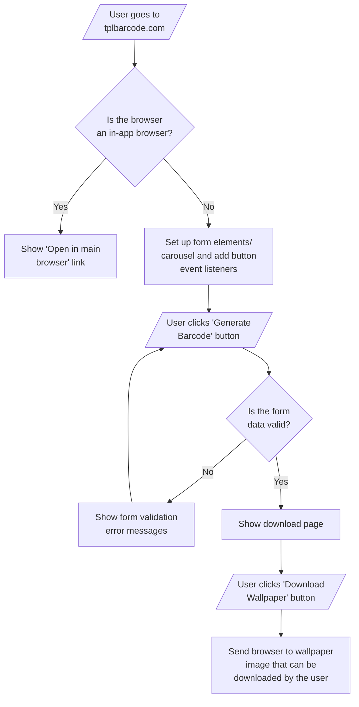
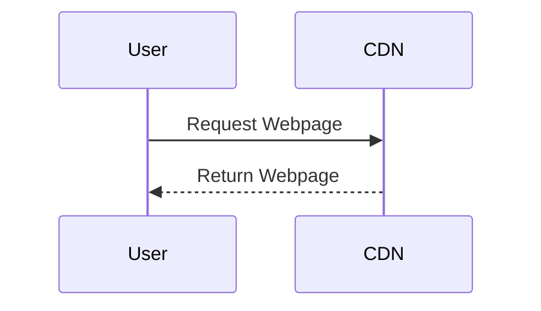

# TPL Barcode Generator

TPL Barcode Generator is a tool that generates phone wallpapers that double as digital Toronto Public Library cards. A digital version of your library card can be useful if you want to lighten your wallet or avoid forgetting your physical card.

[tplbarcode.com](https://tplbarcode.com/)

## TPL Barcode Generator Process Flow Diagram

## TPL Barcode Generator Hosting Setup

All application logic is performed by the user's browser. This allows the app to be hosted for free on Cloudflare Pages.
